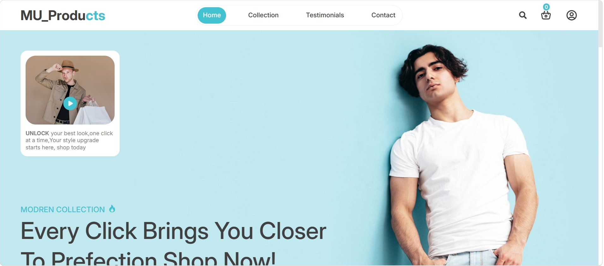
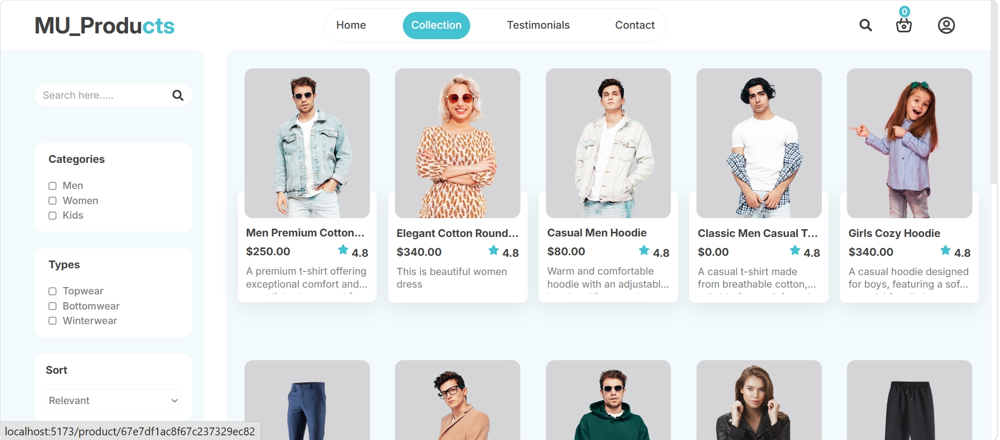
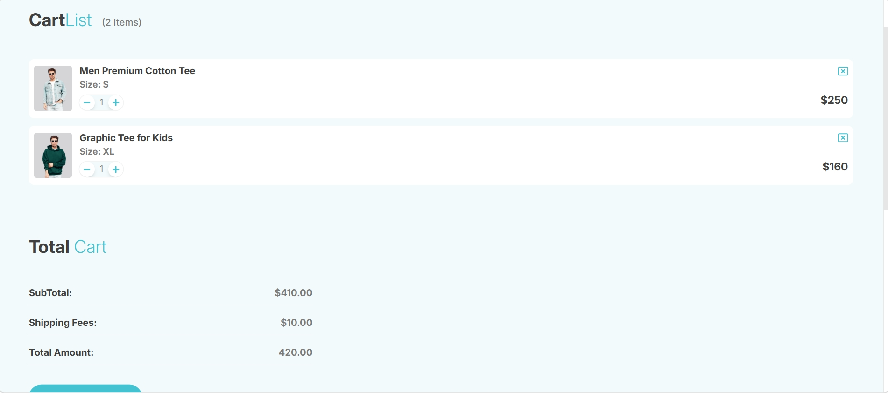
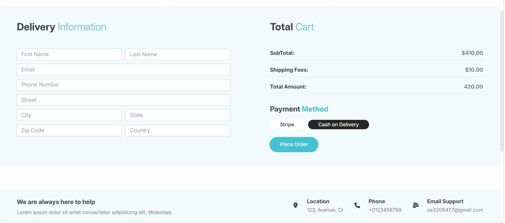
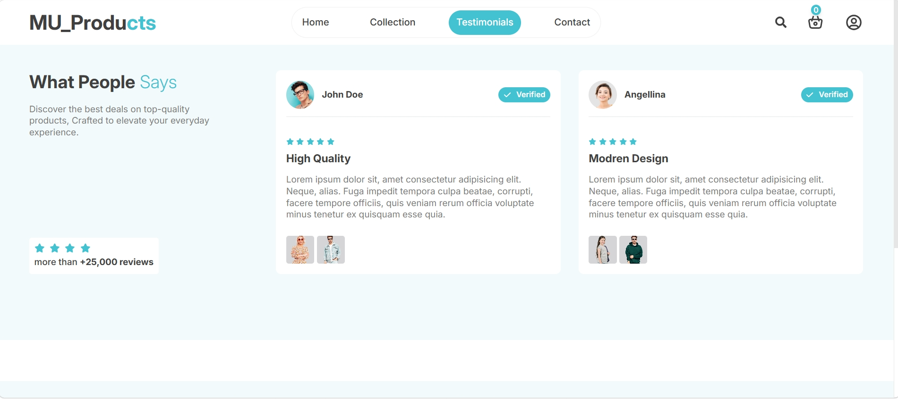
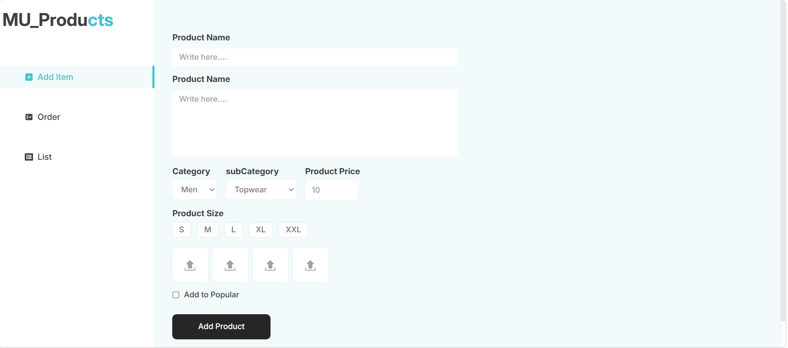
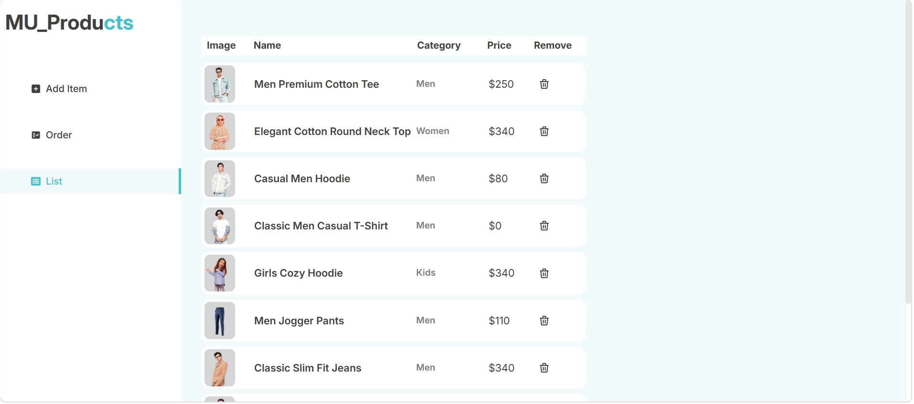
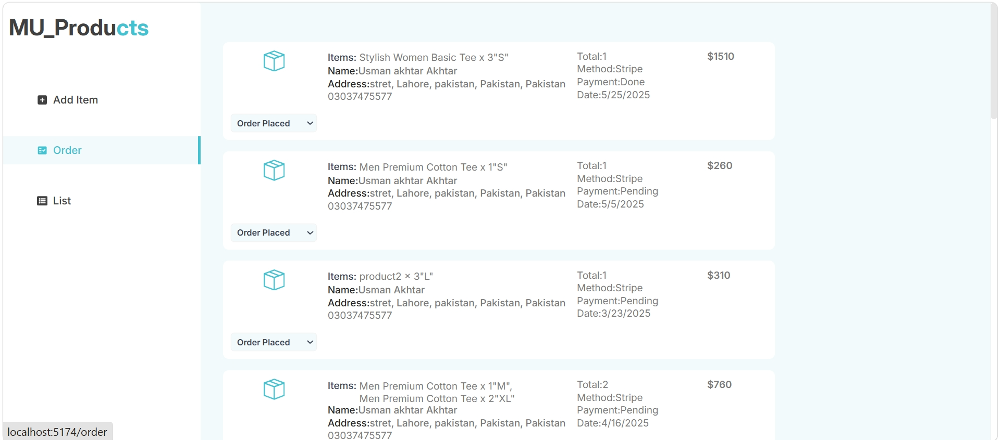

# MUProducts MERN Stack Web

MUProducts is a MERN stack e-commerce project with three separate apps:

- `frontend` - customer-facing React store
- `admin` - admin dashboard for product and order management
- `backend` - Express/MongoDB API for authentication, products, cart, orders, Cloudinary uploads, and Stripe payments

The customer app includes product browsing, cart, checkout, testimonials, and a contact page. The admin app handles product uploads, product listings, orders, and order status updates.

## Tech Stack

| Layer | Technology |
| --- | --- |
| Frontend | React 19, Vite, Tailwind CSS, React Router, Axios, React Toastify |
| Admin Panel | React 19, Vite, Tailwind CSS, React Router, Axios |
| Backend | Node.js, Express, MongoDB, Mongoose |
| Authentication | JWT, bcrypt |
| File Uploads | Multer, Cloudinary |
| Payments | Stripe Checkout |
| Deployment Config | Vercel rewrites/config files |

## Project Structure

```text
MUProducts MERN stack Web/
  admin/
    src/
      components/
      pages/
    package.json
    vercel.json
  backend/
    config/
    controller/
    middleware/
    models/
    routes/
    server.js
    package.json
    versel.json
  frontend/
    src/
      assets/
      components/
      context/
      pages/
    package.json
    versel.json
  README.md
```

## Main Features

### Customer Website

- Home page with hero, banner, products, blogs, testimonials, and feature sections
- Product collection page
- Product detail page with size selection
- Cart management
- Contact page with support information and email form
- User registration and login
- Protected order placement flow
- COD order placement
- Stripe checkout payment flow
- Order history page

### Admin Dashboard

- Admin login
- Add new products
- Upload up to four product images
- List all products
- Remove products
- View all orders
- Update order status

### Backend API

- User registration/login with hashed passwords
- Admin authentication with JWT
- Product CRUD endpoints
- Cloudinary image upload support
- User cart add/update/get endpoints
- COD and Stripe order placement
- Stripe payment verification
- Order status management

## Screenshots

### Customer Website

#### Home Page



#### Product Collection



#### Add To Cart



#### Delivery Information



#### Testimonials



### Admin Dashboard

#### Add Items



#### Items List



#### Orders



## Prerequisites

Install these before running the project:

- Node.js 18 or newer
- npm
- MongoDB database URL, local or MongoDB Atlas
- Cloudinary account
- Stripe account

## Environment Variables

Create a `.env` file inside `backend/`.

```env
PORT=4000
MONGO_URL=your_mongodb_connection_string
JWT_SECRET=your_jwt_secret

ADMIN_EMAIL=admin@example.com
ADMIN_PASS=your_admin_password

CLOUDINARY_NAME=your_cloudinary_cloud_name
CLOUDINARY_API_KEY=your_cloudinary_api_key
CLOUDINARY_API_SECURITY_KEY=your_cloudinary_api_secret

STRIPE_SECRET_KEY=your_stripe_secret_key
```

Create a `.env` file inside `frontend/`.

```env
VITE_BACKEND_URL=http://localhost:4000
```

Create a `.env` file inside `admin/`.

```env
VITE_BACKEND_URL=http://localhost:4000
```

Never commit real `.env` files. This project already ignores `.env`, `*.env`, `node_modules`, `dist`, and `build`.

## Installation

Install dependencies separately for each app.

```bash
cd backend
npm install
```

```bash
cd ../frontend
npm install
```

```bash
cd ../admin
npm install
```

## Running Locally

Open three terminal windows.

### 1. Start Backend

```bash
cd backend
npm run server
```

Backend runs on:

```text
http://localhost:4000
```

You can test the API root:

```text
http://localhost:4000/
```

Expected response:

```text
API working
```

### 2. Start Frontend

```bash
cd frontend
npm run dev
```

Vite will show the local URL, usually:

```text
http://localhost:5173
```

### 3. Start Admin Panel

```bash
cd admin
npm run dev
```

If the frontend is already using `5173`, Vite will start the admin app on the next available port, usually:

```text
http://localhost:5174
```

## Available Scripts

### Backend

| Command | Description |
| --- | --- |
| `npm start` | Start backend with Node |
| `npm run server` | Start backend with Nodemon |

### Frontend

| Command | Description |
| --- | --- |
| `npm run dev` | Start Vite dev server |
| `npm run build` | Build production files |
| `npm run preview` | Preview production build |
| `npm run lint` | Run ESLint |

### Admin

| Command | Description |
| --- | --- |
| `npm run dev` | Start Vite dev server |
| `npm run build` | Build production files |
| `npm run preview` | Preview production build |
| `npm run lint` | Run ESLint |

## API Endpoints

Base URL:

```text
http://localhost:4000
```

### User Routes

| Method | Endpoint | Description |
| --- | --- | --- |
| `POST` | `/api/user/register` | Register a new user |
| `POST` | `/api/user/login` | Login user |
| `POST` | `/api/user/admin` | Login admin |

### Product Routes

| Method | Endpoint | Auth | Description |
| --- | --- | --- | --- |
| `GET` | `/api/product/list` | Public | Get all products |
| `POST` | `/api/product/single` | Public | Get single product by ID |
| `POST` | `/api/product/add` | Admin | Add product with images |
| `POST` | `/api/product/remove` | Admin | Remove product |

### Cart Routes

| Method | Endpoint | Auth | Description |
| --- | --- | --- | --- |
| `POST` | `/api/cart/add` | User | Add item to cart |
| `POST` | `/api/cart/update` | User | Update cart quantity |
| `POST` | `/api/cart/get` | User | Get user cart |

### Order Routes

| Method | Endpoint | Auth | Description |
| --- | --- | --- | --- |
| `POST` | `/api/order/place` | User | Place COD order |
| `POST` | `/api/order/stripe` | User | Create Stripe checkout session |
| `POST` | `/api/order/verifystripe` | User | Verify Stripe payment |
| `POST` | `/api/order/userorders` | User | Get logged-in user's orders |
| `POST` | `/api/order/list` | Admin | Get all orders |
| `POST` | `/api/order/status` | Admin | Update order status |

## Product Data Shape

Products are stored with this structure:

```js
{
  name: String,
  description: String,
  price: Number,
  image: Array,
  category: String,
  subCategory: String,
  sizes: Array,
  popular: Boolean,
  date: Number
}
```

## Order Data Shape

Orders are stored with this structure:

```js
{
  user: String,
  items: Array,
  amount: Number,
  address: Object,
  status: String,
  paymentMethod: String,
  payment: Boolean,
  date: Number
}
```

Default order status:

```text
Order Placed
```

## Authentication

User routes use JWT tokens. Protected user routes expect a token in the request headers:

```text
token: your_user_jwt_token
```

Admin routes also expect a token in headers:

```text
token: your_admin_jwt_token
```

Admin login checks `ADMIN_EMAIL` and `ADMIN_PASS` from `backend/.env`.

## Image Uploads

The admin product add form can upload these image fields:

```text
image1
image2
image3
image4
```

Images are uploaded to Cloudinary, and the returned secure URLs are saved in MongoDB.

## Payments

The project supports:

- Cash on Delivery
- Stripe Checkout

Stripe uses:

```env
STRIPE_SECRET_KEY=your_stripe_secret_key
```

After Stripe checkout, the frontend redirects to:

```text
/verify?success=true&orderId=ORDER_ID
/verify?success=false&orderId=ORDER_ID
```

## Deployment Notes

### Backend

The backend has a Vercel config file named `versel.json`. If deploying to Vercel, Vercel normally expects:

```text
vercel.json
```

Rename it if needed before deployment.

### Frontend and Admin

Both Vite apps include rewrite config for SPA routing. If deploying to Vercel, also confirm the config filename is `vercel.json`.

Set these environment variables in the deployed frontend/admin projects:

```env
VITE_BACKEND_URL=https://your-backend-domain.com
```

Set all backend environment variables in the deployed backend project.

## Common Issues

### Backend says MongoDB connection failed

Check:

- `MONGO_URL` is correct
- MongoDB Atlas IP access allows your current IP or deployment provider
- Database user/password are correct

### Images are not uploading

Check:

- Cloudinary env variables are correct
- Product form is sending `multipart/form-data`
- File field names are `image1`, `image2`, `image3`, `image4`

### Frontend cannot call backend

Check:

- Backend is running
- `VITE_BACKEND_URL` is correct
- Frontend/admin dev server was restarted after changing `.env`

### Admin login fails

Check:

- `ADMIN_EMAIL` and `ADMIN_PASS` are set in `backend/.env`
- Backend server was restarted after changing `.env`
- You are using the same email/password in the admin login form

### Stripe checkout fails

Check:

- `STRIPE_SECRET_KEY` is valid
- Backend is receiving the `origin` header
- Stripe account is configured for test or live mode correctly

## Build for Production

Frontend:

```bash
cd frontend
npm run build
```

Admin:

```bash
cd admin
npm run build
```

Backend:

```bash
cd backend
npm start
```

## Author

MUProducts MERN Stack Web
